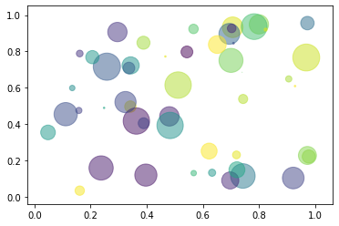

# Sample Markup
* This is a text
    1. This is one too


```python
print('Hello World')
```

    Hello World
    


```python
name = 'John'
```


```python
name
```


    'John'


```python
name = 'Boy'
```


```python
!pip list
```

    Package                            Version  
    ---------------------------------- ---------
    alabaster                          0.7.12   
    anaconda-client                    1.7.2    
    anaconda-navigator                 1.9.7    
    anaconda-project                   0.8.3    
    asn1crypto                         1.0.1    
    astroid                            2.3.1    
    astropy                            3.2.1    
    atomicwrites                       1.3.0    
    attrs                              19.2.0   
    Babel                              2.7.0    
    backcall                           0.1.0    
    backports.functools-lru-cache      1.5      
    backports.os                       0.1.1    
    backports.shutil-get-terminal-size 1.0.0    
    backports.tempfile                 1.0      
    backports.weakref                  1.0.post1
    beautifulsoup4                     4.8.0    
    bitarray                           1.0.1    
    bkcharts                           0.2      
    bleach                             3.1.0    
    bokeh                              1.3.4    
    boto                               2.49.0   
    Bottleneck                         1.2.1    
    certifi                            2019.9.11
    cffi                               1.12.3   
    chardet                            3.0.4    
    Click                              7.0      
    cloudpickle                        1.2.2    
    clyent                             1.2.2    
    colorama                           0.4.1    
    comtypes                           1.1.7    
    conda                              4.7.12   
    conda-build                        3.18.9   
    conda-package-handling             1.6.0    
    conda-verify                       3.4.2    
    contextlib2                        0.6.0    
    cryptography                       2.7      
    cycler                             0.10.0   
    Cython                             0.29.13  
    cytoolz                            0.10.0   
    dask                               2.5.2    
    decorator                          4.4.0    
    defusedxml                         0.6.0    
    distributed                        2.5.2    
    docutils                           0.15.2   
    entrypoints                        0.3      
    et-xmlfile                         1.0.1    
    fastcache                          1.1.0    
    filelock                           3.0.12   
    Flask                              1.1.1    
    fsspec                             0.5.2    
    future                             0.17.1   
    gevent                             1.4.0    
    glob2                              0.7      
    greenlet                           0.4.15   
    h5py                               2.9.0    
    HeapDict                           1.0.1    
    html5lib                           1.0.1    
    idna                               2.8      
    imageio                            2.6.0    
    imagesize                          1.1.0    
    importlib-metadata                 0.23     
    ipykernel                          5.1.2    
    ipython                            7.8.0    
    ipython-genutils                   0.2.0    
    ipywidgets                         7.5.1    
    isort                              4.3.21   
    itsdangerous                       1.1.0    
    jdcal                              1.4.1    
    jedi                               0.15.1   
    Jinja2                             2.10.3   
    joblib                             0.13.2   
    json5                              0.8.5    
    jsonschema                         3.0.2    
    jupyter                            1.0.0    
    jupyter-client                     5.3.3    
    jupyter-console                    6.0.0    
    jupyter-core                       4.5.0    
    jupyterlab                         1.1.4    
    jupyterlab-server                  1.0.6    
    keyring                            18.0.0   
    kiwisolver                         1.1.0    
    lazy-object-proxy                  1.4.2    
    libarchive-c                       2.8      
    llvmlite                           0.29.0   
    locket                             0.2.0    
    lxml                               4.4.1    
    MarkupSafe                         1.1.1    
    matplotlib                         3.1.1    
    mccabe                             0.6.1    
    menuinst                           1.4.16   
    mistune                            0.8.4    
    mkl-fft                            1.0.14   
    mkl-random                         1.1.0    
    mkl-service                        2.3.0    
    mock                               3.0.5    
    more-itertools                     7.2.0    
    mpmath                             1.1.0    
    msgpack                            0.6.1    
    multipledispatch                   0.6.0    
    navigator-updater                  0.2.1    
    nbconvert                          5.6.0    
    nbformat                           4.4.0    
    networkx                           2.3      
    nltk                               3.4.5    
    nose                               1.3.7    
    notebook                           6.0.1    
    numba                              0.45.1   
    numexpr                            2.7.0    
    numpy                              1.16.5   
    numpydoc                           0.9.1    
    olefile                            0.46     
    openpyxl                           3.0.0    
    packaging                          19.2     
    pandas                             0.25.1   
    pandocfilters                      1.4.2    
    parso                              0.5.1    
    partd                              1.0.0    
    path.py                            12.0.1   
    pathlib2                           2.3.5    
    patsy                              0.5.1    
    pep8                               1.7.1    
    pickleshare                        0.7.5    
    Pillow                             6.2.0    
    pip                                19.2.3   
    pkginfo                            1.5.0.1  
    pluggy                             0.13.0   
    ply                                3.11     
    prometheus-client                  0.7.1    
    prompt-toolkit                     2.0.10   
    psutil                             5.6.3    
    py                                 1.8.0    
    pycodestyle                        2.5.0    
    pycosat                            0.6.3    
    pycparser                          2.19     
    pycrypto                           2.6.1    
    pycurl                             7.43.0.3 
    pyflakes                           2.1.1    
    Pygments                           2.4.2    
    pylint                             2.4.2    
    pyodbc                             4.0.27   
    pyOpenSSL                          19.0.0   
    pyparsing                          2.4.2    
    pyreadline                         2.1      
    pyrsistent                         0.15.4   
    PySocks                            1.7.1    
    pytest                             5.2.1    
    pytest-arraydiff                   0.3      
    pytest-astropy                     0.5.0    
    pytest-doctestplus                 0.4.0    
    pytest-openfiles                   0.4.0    
    pytest-remotedata                  0.3.2    
    python-dateutil                    2.8.0    
    pytz                               2019.3   
    PyWavelets                         1.0.3    
    pywin32                            223      
    pywinpty                           0.5.5    
    PyYAML                             5.1.2    
    pyzmq                              18.1.0   
    QtAwesome                          0.6.0    
    qtconsole                          4.5.5    
    QtPy                               1.9.0    
    requests                           2.22.0   
    rope                               0.14.0   
    ruamel-yaml                        0.15.46  
    scikit-image                       0.15.0   
    scikit-learn                       0.21.3   
    scipy                              1.3.1    
    seaborn                            0.9.0    
    Send2Trash                         1.5.0    
    setuptools                         41.4.0   
    simplegeneric                      0.8.1    
    singledispatch                     3.4.0.3  
    six                                1.12.0   
    snowballstemmer                    2.0.0    
    sortedcollections                  1.1.2    
    sortedcontainers                   2.1.0    
    soupsieve                          1.9.3    
    Sphinx                             2.2.0    
    sphinxcontrib-applehelp            1.0.1    
    sphinxcontrib-devhelp              1.0.1    
    sphinxcontrib-htmlhelp             1.0.2    
    sphinxcontrib-jsmath               1.0.1    
    sphinxcontrib-qthelp               1.0.2    
    sphinxcontrib-serializinghtml      1.1.3    
    sphinxcontrib-websupport           1.1.2    
    spyder                             3.3.6    
    spyder-kernels                     0.5.2    
    SQLAlchemy                         1.3.9    
    statsmodels                        0.10.1   
    sympy                              1.4      
    tables                             3.5.2    
    tblib                              1.4.0    
    terminado                          0.8.2    
    testpath                           0.4.2    
    toolz                              0.10.0   
    tornado                            6.0.3    
    tqdm                               4.36.1   
    traitlets                          4.3.3    
    unicodecsv                         0.14.1   
    urllib3                            1.24.2   
    wcwidth                            0.1.7    
    webencodings                       0.5.1    
    Werkzeug                           0.16.0   
    wheel                              0.33.6   
    widgetsnbextension                 3.5.1    
    win-inet-pton                      1.1.0    
    win-unicode-console                0.5      
    wincertstore                       0.2      
    wrapt                              1.11.2   
    xlrd                               1.2.0    
    XlsxWriter                         1.2.1    
    xlwings                            0.15.10  
    xlwt                               1.3.0    
    zict                               1.0.0    
    zipp                               0.6.0    
    


```python
%lsmagic
```


    Available line magics:
    %alias  %alias_magic  %autoawait  %autocall  %automagic  %autosave  %bookmark  %cd  %clear  %cls  %colors  %conda  %config  %connect_info  %copy  %ddir  %debug  %dhist  %dirs  %doctest_mode  %echo  %ed  %edit  %env  %gui  %hist  %history  %killbgscripts  %ldir  %less  %load  %load_ext  %loadpy  %logoff  %logon  %logstart  %logstate  %logstop  %ls  %lsmagic  %macro  %magic  %matplotlib  %mkdir  %more  %notebook  %page  %pastebin  %pdb  %pdef  %pdoc  %pfile  %pinfo  %pinfo2  %pip  %popd  %pprint  %precision  %prun  %psearch  %psource  %pushd  %pwd  %pycat  %pylab  %qtconsole  %quickref  %recall  %rehashx  %reload_ext  %ren  %rep  %rerun  %reset  %reset_selective  %rmdir  %run  %save  %sc  %set_env  %store  %sx  %system  %tb  %time  %timeit  %unalias  %unload_ext  %who  %who_ls  %whos  %xdel  %xmode
    
    Available cell magics:
    %%!  %%HTML  %%SVG  %%bash  %%capture  %%cmd  %%debug  %%file  %%html  %%javascript  %%js  %%latex  %%markdown  %%perl  %%prun  %%pypy  %%python  %%python2  %%python3  %%ruby  %%script  %%sh  %%svg  %%sx  %%system  %%time  %%timeit  %%writefile
    
    Automagic is ON, % prefix IS NOT needed for line magics.


```python
%pwd
```


    'C:\\data\\jupyter'


```python
#from ipywidgets import *
from IPython.display import display
w = IntSlider()
display(w)
```


    IntSlider(value=0)


```python
w.value = 99
```


```python
w.keys
```


    ['_dom_classes',
     '_model_module',
     '_model_module_version',
     '_model_name',
     '_view_count',
     '_view_module',
     '_view_module_version',
     '_view_name',
     'continuous_update',
     'description',
     'description_tooltip',
     'disabled',
     'layout',
     'max',
     'min',
     'orientation',
     'readout',
     'readout_format',
     'step',
     'style',
     'value']


```python
from IPython.utils.traitlets import link
a = FloatText()
b = FloatSlider()
c = FloatProgress()
display(a,b,c)

mylink = link((a, 'value'), (b, 'value'))
mylink2 = link((b, 'value'), (c, 'value'))
```


    FloatText(value=0.0)


    FloatSlider(value=0.0)


    FloatProgress(value=0.0)


```python
mylink.unlink()
mylink2.unlink()
```


```python
import numpy as np
import matplotlib.pyplot as plt

# Fixing random state for reproducibility
np.random.seed(19680801)


N = 50
x = np.random.rand(N)
y = np.random.rand(N)
colors = np.random.rand(N)
area = (30 * np.random.rand(N))**2  # 0 to 15 point radii

plt.scatter(x, y, s=area, c=colors, alpha=0.5)
plt.show()
```





```python
%%HTML
<p><a href="https://www.w3schools.com">w3schools</a></p>

<iframe width="800" src="https://www.w3schools.com"></iframe>

```


<p><a href="https://www.w3schools.com">w3schools</a></p>

<iframe width="800" src="https://www.w3schools.com"></iframe>


```python
%%timeit
square_evens = [n*n for n in range(100)]
```

    13.5 µs ± 159 ns per loop (mean ± std. dev. of 7 runs, 100000 loops each)
    


```python
import pandas as pd
import numpy as np

df = pd.DataFrame(np.random.randn(10,5))
df.head()
```


<div>
<style scoped>
    .dataframe tbody tr th:only-of-type {
        vertical-align: middle;
    }

    .dataframe tbody tr th {
        vertical-align: top;
    }

    .dataframe thead th {
        text-align: right;
    }
</style>
<table border="1" class="dataframe">
  <thead>
    <tr style="text-align: right;">
      <th></th>
      <th>0</th>
      <th>1</th>
      <th>2</th>
      <th>3</th>
      <th>4</th>
    </tr>
  </thead>
  <tbody>
    <tr>
      <td>0</td>
      <td>0.835275</td>
      <td>0.181993</td>
      <td>1.232291</td>
      <td>-0.996842</td>
      <td>-0.804238</td>
    </tr>
    <tr>
      <td>1</td>
      <td>1.833230</td>
      <td>0.084046</td>
      <td>-0.466226</td>
      <td>-0.458791</td>
      <td>-0.623695</td>
    </tr>
    <tr>
      <td>2</td>
      <td>0.645133</td>
      <td>-1.851581</td>
      <td>0.843342</td>
      <td>1.093867</td>
      <td>0.456576</td>
    </tr>
    <tr>
      <td>3</td>
      <td>0.273131</td>
      <td>-1.916821</td>
      <td>0.162999</td>
      <td>0.920437</td>
      <td>-0.667275</td>
    </tr>
    <tr>
      <td>4</td>
      <td>-0.046662</td>
      <td>-0.613771</td>
      <td>-0.374934</td>
      <td>0.516941</td>
      <td>0.538914</td>
    </tr>
  </tbody>
</table>
</div>


